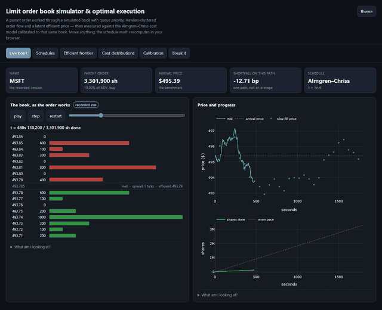

# Optimal execution against a simulated limit order book

A limit order book simulator with Hawkes-driven order flow, the Almgren–Chriss
closed form solved on top of it, and an honest measurement of where the closed
form stops describing the market it is supposed to describe.


**Live demo:** https://codeebytee.github.io/08-lob-optimal-execution/ *(enable Pages: Settings → Pages → main /docs)*

**[→ Open the interactive interface](https://codeebytee.github.io/08-lob-optimal-execution/)**
(runs offline; no server, no install — or double-click `docs/index.html`)

**Run the interface locally:** clone the repo and double-click `docs/index.html`.
Nothing to install — `requirements.txt` is only needed to re-run the research.



---

## The problem

A portfolio manager decides to buy 250,000 shares of Microsoft. Trade fast and
you walk up the book and reveal your intent; the price moves against you and
stays moved. Trade slowly and you avoid that, but you are exposed to volatility
for half an hour. Almgren–Chriss (2000) is the canonical answer: minimise
`E[cost] + λ·Var[cost]`.

Implementing that closed form is fifteen lines. The interesting question is
whether it describes anything real — its assumptions (linear impact, an
infinitely elastic market, a schedule that can always be executed) are all false
in ways that matter. So this project builds the market the model is supposed to
describe, calibrates the model to that market, and measures the gap.

## What it does

- **A matching engine** (`src/lob/book.py`) with FIFO priority within a price,
  price priority across prices, partial cancels that preserve queue position.
- **A venue around it** (`src/lob/simulator.py`): power-law limit order arrival
  by distance from touch, two-sided Hawkes market orders, hazard-rate cancels,
  stale-quote handling, and quotes anchored to a latent efficient price with a
  Kyle-λ impact term.
- **Calibration** (`src/flow/calibrate.py`) of that venue to real names from a
  daily-bar snapshot — flow rates to ADV, Kyle λ to volatility-over-volume.
- **Five execution algorithms** (TWAP, VWAP, POV, Almgren–Chriss, Adaptive)
  compared on common random numbers with paired counterfactuals.
- **An interactive page** (`docs/`) that recomputes the real solver in the
  browser on every slider move, with the JS port pinned to the Python by a
  parity test.

## Headline results

Calibrated to 8 names (SPY, AAPL, MSFT, XOM, KO, TSLA, GME, IWM) as of
2026-08-17. Every number below is produced by `scripts/make_results.py` and
stored in `results/`.

**Half of a large order's cost is untouchable.** The permanent-impact term is
identical across algorithms, so once parent size is fixed the entire argument
between execution algos is over the temporary part. The highest-value
conversation is with the PM about size, not with the vendor about algorithms.

**Between algorithms, differences are small, real, and easily mistaken for
noise.** On a single order the spread of outcomes is an order of magnitude
larger than the gap between algorithms — which is why execution quality is
judged over hundreds of orders and never over one. The paired tests in
`results/paired_vs_twap.csv` are what separate signal from luck.

**The model understates the cost of urgency.** The closed form charges `ηv` per
share — linear — while walking a finite book is convex. Agreement is good for
patient schedules and deteriorates as `λ` rises.

**Past a certain size, the model stops describing anything.** Below roughly 0.5%
of a day's volume in half an hour, everything fills and costs grow smoothly.
Past that the venue cannot supply the shares inside the horizon, and the closed
form — which has no term for an unfillable order — gives an answer that is not
merely inaccurate but meaningless.

**What the cost number includes.** Arrival-price implementation shortfall on
fills that actually happened in the book: the spread the agent's child orders
crossed, the impact the book showed, and the unfilled remainder marked at the
terminal mid with the fill rate reported next to it. Gross of exchange fees —
constant per share, so it moves the level and no comparison. Algorithms see
lagged information only; POV sizes off the previous slice's volume and VWAP
follows the forecast curve, not the realised one. Details in `DEEP_DIVE.md` §3.5.

**Across names, cost is volatility over liquidity.** What separates expensive
names from cheap ones is not price or sector but the ratio of dollar volatility
to volume — the same quantity Kyle's λ is built from.

## Validation

148 tests (`pytest`). The engine is fuzz-tested over 3,000 random operations
against its invariants. Hawkes MLE recovers the branching ratio to ±0.12 and
time-rescaling residuals are unit-exponential under the true model. The closed
form reproduces TWAP exactly as `λ→0`, satisfies its defining `cosh` equation to
1e-12, and matches a 40,000-path Monte Carlo to 2–3%. The measured impact
coefficient recovers the Kyle λ the venue was built with to 76% — the gap is
the part of the latent price move that the mid does not show. The JavaScript
port matches `src/` to 6e-15.

Two spread estimators (Corwin–Schultz, Abdi–Ranaldo) are validated against a
synthetic Roll model where the true spread is known, then both fail on real
large caps by one to two orders of magnitude in opposite directions. That
failure is a reported result, and it is why the project does not take its spread
from daily bars.

## Running it

```bash
pip install -r requirements.txt

pytest                                  # 148 tests
python scripts/make_results.py --quick  # ~2 min smoke test
python scripts/make_results.py          # full run, ~2 hours on 8 cores
python scripts/build_frontend.py        # regenerate docs/data.js from results/
python scripts/check_page.py            # verify docs/ ships and the JS matches src/
```

The full run is 2,250 tournament cells × 9 algorithm variants plus the impact
sweep and the cross-section; budget a couple of hours. (`results/make_results.log`
reports 57,460s of wall clock for the shipped run because the machine suspended
overnight partway through — the CPU time is about 7,800s.)

Everything is seeded — two runs produce identical numbers.
`scripts/refresh_data.py` is the only script that touches the network; without
it the committed snapshot in `data/` is used.

## Design decisions

**A latent efficient price, not pure order flow.** A book driven only by
self-exciting arrivals produces a price that random-walks with the wrong
variance and no anchor. Quotes here are posted around a latent price that
diffuses at the name's measured volatility and absorbs a Kyle-λ impact term
from signed volume. The cost is one extra unobservable; the gain is a venue
whose ADV and volatility match the real name, which is the only reason
calibrated numbers mean anything.

**Impact is measured, not assumed.** Almgren–Chriss needs η and γ. Reading them
off the config the venue was built with would make the validation circular, so
the coefficients are estimated by executing orders against the simulator at a
range of participation rates and regressing shortfall on rate — the same
procedure a broker runs on its own fills. Recovering the Kyle λ the venue was
constructed with to 76% is then a real test rather than an identity.

**Live JS for the closed form, precomputed grids for the simulator.** The
schedule maths, cost decomposition and frontier are cheap, so they are ported to
JavaScript and recomputed on every slider move, with a parity test pinning the
port to `src/` at 6e-15. The book, the impact calibration and the shortfall
distributions cost minutes of CPU each, so Python sweeps the grid and the page
interpolates and says so. The alternative — precomputing everything — makes the
page a slideshow, and the honest version of "this is a lookup" is a label, not a
hidden one.

## Where to start

| If you want | Read |
|---|---|
| No finance background | [`PREREQUISITES.md`](PREREQUISITES.md) |
| The picture, in 30 seconds | [`docs/index.html`](docs/index.html) — the "Live book" tab, press play |
| The maths and the failure modes | [`DEEP_DIVE.md`](DEEP_DIVE.md) |
| The results built up step by step | [`notebooks/execution_story.ipynb`](notebooks/execution_story.ipynb) |
| The code | `src/lob/book.py` → `simulator.py` → `execution/almgren_chriss.py` → `execution/runner.py` → `flow/calibrate.py` |

## References

Almgren & Chriss (2000), *Optimal execution of portfolio transactions*.
Cont, Stoikov & Talreja (2010), *A stochastic model for order book dynamics*.
Kyle (1985), *Continuous auctions and insider trading*.
Full list in [`DEEP_DIVE.md`](DEEP_DIVE.md#9-references).

## License

MIT — see [`LICENSE`](LICENSE).
